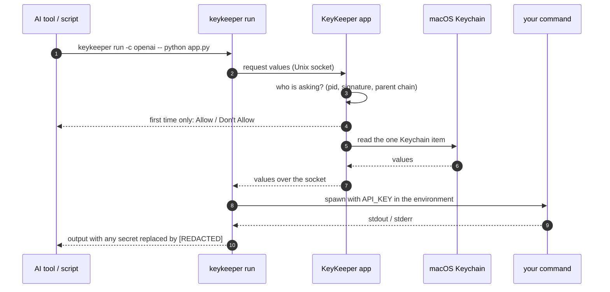

<p align="center">
  
</p>

<p align="center">
  <a href="https://keykeeper.dev"></a>
  <a href="https://github.com/IvyYang1999/KeyKeeper/blob/main/LICENSE"></a>
  
  
  <a href="https://github.com/IvyYang1999/KeyKeeper/stargazers"></a>
  <a href="https://github.com/IvyYang1999/KeyKeeper/commits/main"></a>
</p>

<p align="center">
  <b>English</b> · <a href="README.zh-CN.md">简体中文</a>
</p>

<p align="center">
  <a href="#quick-start">Quick start</a> ·
  <a href="#how-it-works">How it works</a> ·
  <a href="#why-not-just-env">Why not .env</a> ·
  <a href="#ai-tools">AI tools</a> ·
  <a href="#security-model">Security model</a> ·
  <a href="https://keykeeper.dev">keykeeper.dev</a>
</p>

---

KeyKeeper is a small macOS menu bar app, a `keykeeper` CLI and two thin SDKs. API keys live in the **macOS Keychain**, and `keykeeper run` injects them into the one command that needs them. Claude Code, Cursor, Copilot, cron jobs and scripts only ever see the key's **name**.

There is no master password, no vault to unlock, no `.env` to leak into git or chat. Logging into your Mac is the unlock.

<p align="center">
  
</p>

## Contents

- [Quick start](#quick-start)
- [How it works](#how-it-works)
- [Why not just .env?](#why-not-just-env)
- [Everyday commands](#everyday-commands)
- [Who can use a key](#who-can-use-a-key)
- [AI tools](#ai-tools)
- [SDKs](#sdks)
- [Security model](#security-model)
- [Troubleshooting](#troubleshooting)
- [Project structure](#project-structure)
- [Roadmap](#roadmap)
- [Contributing](#contributing)

## Quick start

**Requirements:** macOS 14+ and the Xcode command line tools (`xcode-select --install`). Signed binaries and Homebrew are on the [roadmap](#roadmap); today you build from source, which takes about a minute.

```bash
git clone https://github.com/IvyYang1999/KeyKeeper.git
cd KeyKeeper
./scripts/build-app.sh                       # dist/dmg/KeyKeeper.app + dist/KeyKeeper-<version>.dmg
cp -R dist/dmg/KeyKeeper.app /Applications/
open /Applications/KeyKeeper.app
```

1. **First run** — the setup screen installs the `keykeeper` CLI (asks for your password once) and shows a one-line prompt that installs the Claude Code skill.
2. **Add a key** — click **+** in the menu bar window, type a name such as `OpenAI`, paste the value into `api-key`. The ID (`openai`) and the environment variable (`API_KEY`) are shown as you type.
3. **Use it** — run anything with the key injected into that process only:

   ```bash
   keykeeper run -c openai -- python script.py     # script reads os.environ["API_KEY"]
   keykeeper run -c openai -- claude               # an AI tool that never sees the value
   ```

That is the whole setup. No passphrase to choose, no recovery key to file away.

## How it works



- **Store** — add a key in the app, or open a prefilled form with a `keykeeper://add?label=…&fields=…` link. Values go into a single Keychain item, encrypted by macOS and synced to nothing. Names, notes and field names stay in a plain `meta.json`.
- **Use** — `keykeeper run -c <id> -- <command>` injects the secret fields as environment variables. Anything the command prints that contains a secret comes out as `[REDACTED]`. The app starts on demand.
- **Approve** — the first time a new terminal session, script or agent asks for a key, KeyKeeper shows *who* is asking and lets you say yes once. Approvals are listed on the credential's page and can be revoked.
- **Reboot** — log in once and everything, cron jobs included, works again. No prompts in day-to-day use.

## Why not just .env?

|  | `.env` file | 1Password `op run` | Cloud secret manager | **KeyKeeper** |
|---|---|---|---|---|
| Where the value lives | Plain text in the project | 1Password vault | Someone's cloud | macOS Keychain |
| What the AI tool sees | The value | The value, via `op` | The value, via SDK | **The name only** |
| Unlock | Nothing | Master password + subscription | Account + network | **Your Mac login** |
| Who may ask | Anyone who can read the file | Any process with a service-account token | Any process with credentials | **Each calling process, approved once** |
| Output redaction | No | No | No | **Yes** |
| Offline / cron | Yes | Needs the agent unlocked | Needs network | **Yes, after login** |
| Cost | Free | Paid | Paid | **Free, MIT** |

The moat is the fourth row. Token-based tools hand out a reusable secret that any process can present; KeyKeeper derives identity from the calling process itself, so there is no token to copy around.

## Everyday commands

| Command | What it does |
|---|---|
| `keykeeper list` | IDs and labels |
| `keykeeper list --detail` | plus notes and field names (secrets shown as `********`) |
| `keykeeper meta <id>` | one credential as JSON, no values |
| `keykeeper run -c <id> [-c <id2>] [--prefix PREFIX_] [--verbose] [--tty] -- <command>` | run a command with the keys injected |
| `keykeeper status` | is the app reachable (it starts on demand anyway) |
| `keykeeper grants list` / `grants revoke <id>` | approved background callers |
| `keykeeper requests list` | approval windows currently waiting |
| `keykeeper get <id> <field>` | used by the SDKs; refuses to print to a terminal unless `--reveal` |

`--tty` hands the command a real terminal (editors, TUIs, interactive agents); output redaction is off in that mode.

## Who can use a key

Every key group has one of two access modes, shown as a badge in the list:

| Badge | Meaning | Use it for |
|---|---|---|
| **Background OK** (default) | Scripts, cron jobs and agents can use the key after you approve each caller once. | Anything that runs unattended. |
| **Ask every time** | Every new terminal session must be approved in the KeyKeeper window while you are at the Mac. | Keys you only use by hand. |

In **Settings** you can require approval for new background callers and turn on **Launch at Login**. KeyKeeper checks once a day for signed updates and tells you when one is available; turn on **Install updates automatically** if you prefer.

## AI tools

### Claude Code

The [skill](skill/keykeeper.md) teaches Claude Code to discover credentials with `keykeeper list --detail`, run code through `keykeeper run`, offer a prefilled `keykeeper://add?…` link when a key is missing, and never ask for or print values.

```bash
mkdir -p ~/.claude/skills/keykeeper
curl -fsSL https://raw.githubusercontent.com/IvyYang1999/KeyKeeper/main/skill/keykeeper.md \
  -o ~/.claude/skills/keykeeper/SKILL.md
```

Or paste the prompt shown on the setup screen into Claude Code and let it do this.

### Any other tool

Anything that can run a shell command can use KeyKeeper: `keykeeper run -c <id> -- <tool>`. When a key is missing, hand the user a link instead of asking them to retype names:

```
keykeeper://add?label=Stripe&fields=secret-key,publishable-key
```

## SDKs

```bash
pip install ./sdk-python
npm install ./sdk-node
```

```python
from keykeeper import get_key, list_credentials, run
api_key = get_key("openai", "api-key")           # value returned over a pipe
run("openai", ["python", "script.py"])           # same as keykeeper run
```

```javascript
const { getKey, runWithSecrets } = require('keykeeper');
const apiKey = await getKey("openai", "api-key");
runWithSecrets("openai", ["node", "server.js"]);
```

Both SDKs shell out to the `keykeeper` CLI; no native dependencies.

## Security model

| Layer | What happens |
|---|---|
| Values at rest | One generic-password item in the macOS Keychain, encrypted by the OS with your login credentials. Nothing readable sits in a file. |
| Unlocking | Your macOS login. The keychain stays available while the screen is locked and re-locks at logout/reboot — the same model as Safari passwords, `gh`, `aws-vault` and `envchain`. |
| Metadata | `meta.json` holds labels, notes and field *names* in plain text. No values. |
| Using a key | `keykeeper run` injects values into the child process's environment and replaces them with `[REDACTED]` in its stdout/stderr. `keykeeper get` refuses to print to a terminal. |
| Who may ask | Per-credential mode (Background OK / Ask every time) plus per-caller approvals, shown and revocable in the app. Concurrent requests queue up instead of failing. |
| Other apps | The Keychain item's ACL trusts only KeyKeeper's signing identity; any other program that tries to read it triggers the macOS confirmation prompt. |
| Clipboard | Copying a value from the app marks it concealed for clipboard managers and clears it after 30 s unless you copied something else. |
| Backup | The item lives in your login keychain and is covered by your normal macOS backup/restore. An explicit encrypted-export command is on the roadmap. |

**What KeyKeeper does not do:** a child process you approve still receives the value and can misuse, save or transmit it. Output redaction is a safety net, not a sandbox. Only run software you trust with production credentials.

## Troubleshooting

| You see | Do |
|---|---|
| `The KeyKeeper app could not be started` | Open KeyKeeper from Applications once; check it isn't blocked by Gatekeeper. |
| `This caller is not authorized` | Click Authorize in the KeyKeeper window, or set the credential to Background OK. `keykeeper grants list` shows approvals. |
| `Timed out … waiting for approval` | Run it again while you're at the Mac; approval windows wait 2 minutes. |
| Cron jobs fail right after a reboot | Log in once; jobs work from then on (the login keychain unlocks with your session). |
| macOS asks about "confidential information" | You rebuilt KeyKeeper with a different signing identity. Click Always Allow once, or set a stable identity in `.signing-identity` (see `scripts/build-app.sh`). |
| `Refusing to print a secret to the terminal` | Use `keykeeper run`, or add `--reveal` if you really want it on screen. |
| Setup says the CLI is out of date | Click Update CLI (Settings › Command line) so CLI and app come from the same build. |

## Project structure

```
KeyKeeper/
├── Sources/
│   ├── KeyKeeperCore/   # Keychain blob store, metadata, grants, IPC protocol
│   ├── KeyKeeperCLI/    # keykeeper: list, get, meta, run, status, grants, requests, migrate-storage
│   └── KeyKeeperApp/    # menu bar app (SwiftUI): credentials, approvals, settings
├── sdk-python/          # Python SDK (wraps the CLI)
├── sdk-node/            # Node.js SDK (wraps the CLI)
├── skill/               # Claude Code skill
├── scripts/             # build-app.sh, install-cli.sh, git hooks
├── Tests/               # XCTest suites (swift test)
└── Package.swift
```

## Roadmap

- [ ] Signed, notarized DMG on GitHub Releases and a Homebrew cask
- [ ] Encrypted export / import for moving keys between Macs
- [ ] Chinese UI for the app (the website is already bilingual)
- [x] Signed in-app updates
- [x] Per-caller approval with process identity
- [x] `keykeeper://add` deep links for AI tools

## Contributing

1. Fork and branch: `git checkout -b my-feature`
2. Bug fixes come with a test first (`swift test` runs in the pre-commit hook).
3. Keep commits atomic and open a pull request with what changed and why.

## License

[MIT](LICENSE)
