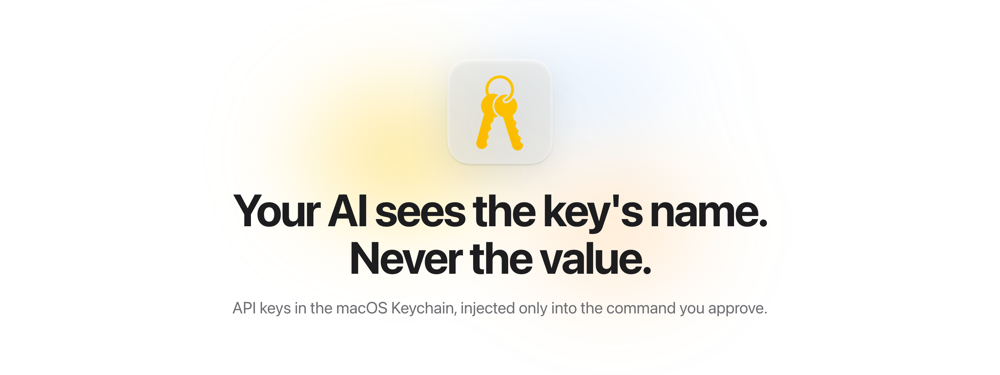
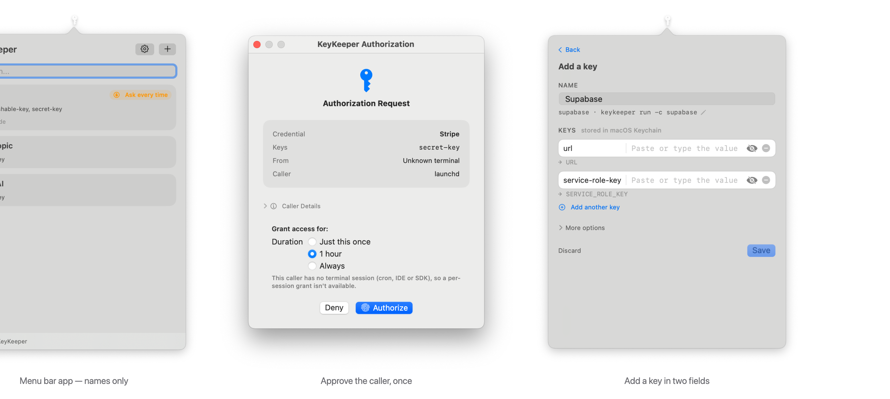
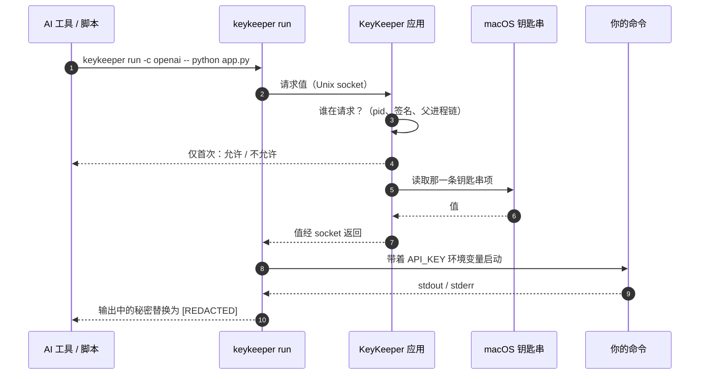

<p align="center">
  
</p>

<p align="center">
  <a href="https://keykeeper.dev"></a>
  <a href="https://github.com/IvyYang1999/KeyKeeper/blob/main/LICENSE"></a>
  
  
  <a href="https://github.com/IvyYang1999/KeyKeeper/stargazers"></a>
  <a href="https://github.com/IvyYang1999/KeyKeeper/commits/main"></a>
</p>

<p align="center">
  <a href="README.md">English</a> · <b>简体中文</b>
</p>

<p align="center">
  <a href="#快速开始">快速开始</a> ·
  <a href="#工作原理">工作原理</a> ·
  <a href="#为什么不直接用-env">为什么不直接用 .env</a> ·
  <a href="#ai-工具">AI 工具</a> ·
  <a href="#安全模型">安全模型</a> ·
  <a href="https://keykeeper.dev">keykeeper.dev</a>
</p>

---

KeyKeeper 是一个小小的 macOS 菜单栏应用，外加 `keykeeper` 命令行和两个很薄的 SDK。API key 存在 **macOS 钥匙串**里，`keykeeper run` 只把它注入到真正需要它的那一条命令。Claude Code、Cursor、Copilot、cron 任务和脚本只能看到 key 的**名字**。

没有主密码，没有要解锁的保险库，没有会泄漏进 git 或对话的 `.env`。登录 Mac 就是解锁。

<p align="center">
  
</p>

## 目录

- [快速开始](#快速开始)
- [工作原理](#工作原理)
- [为什么不直接用 .env](#为什么不直接用-env)
- [常用命令](#常用命令)
- [谁能用这把 key](#谁能用这把-key)
- [AI 工具](#ai-工具)
- [SDK](#sdk)
- [安全模型](#安全模型)
- [排错](#排错)
- [项目结构](#项目结构)
- [路线图](#路线图)
- [参与贡献](#参与贡献)

## 快速开始

**要求：** macOS 14+，以及 Xcode 命令行工具（`xcode-select --install`）。签名安装包和 Homebrew 在[路线图](#路线图)上；现在从源码构建，大约一分钟。

```bash
git clone https://github.com/IvyYang1999/KeyKeeper.git
cd KeyKeeper
./scripts/build-app.sh                       # 生成 dist/dmg/KeyKeeper.app 和 dist/KeyKeeper-<version>.dmg
cp -R dist/dmg/KeyKeeper.app /Applications/
open /Applications/KeyKeeper.app
```

1. **首次运行** — 设置页会安装 `keykeeper` 命令行（问一次密码），并给出一句话提示，粘给 Claude Code 就能装好技能。
2. **添加 key** — 在菜单栏窗口点 **+**，输入名字（比如 `OpenAI`），把值贴进 `api-key`。ID（`openai`）和环境变量名（`API_KEY`）会随着输入实时显示。
3. **用起来** — 任何命令都可以带着 key 跑，key 只注入到这个进程：

   ```bash
   keykeeper run -c openai -- python script.py     # 脚本读 os.environ["API_KEY"]
   keykeeper run -c openai -- claude               # AI 工具从头到尾看不到值
   ```

设置就这么多。不用想密码短语，不用收好恢复码。

## 工作原理



- **存** — 在应用里添加 key，或用 `keykeeper://add?label=…&fields=…` 链接打开预填好的表单。值进入一条钥匙串项，由 macOS 加密，不同步到任何地方。名字、备注、字段名放在明文的 `meta.json` 里。
- **用** — `keykeeper run -c <id> -- <命令>` 把秘密字段注入为环境变量。命令输出里只要含有秘密，就会被替换成 `[REDACTED]`。应用按需自动启动。
- **批准** — 新的终端会话、脚本或 agent 第一次请求某把 key 时，KeyKeeper 会显示*谁*在请求，你点一次允许即可。批准记录列在凭据页面上，可以撤销。
- **重启后** — 登录一次，一切（包括 cron）就恢复工作。日常不会弹任何窗。

## 为什么不直接用 .env

|  | `.env` 文件 | 1Password `op run` | 云端密钥管理 | **KeyKeeper** |
|---|---|---|---|---|
| 值放在哪 | 项目里的明文 | 1Password 保险库 | 别人的云 | macOS 钥匙串 |
| AI 工具看到什么 | 值 | 值（经 `op`） | 值（经 SDK） | **只有名字** |
| 解锁 | 无 | 主密码 + 订阅 | 账号 + 网络 | **你的 Mac 登录** |
| 谁能请求 | 能读文件的任何人 | 拿到服务账号 token 的任何进程 | 拿到凭据的任何进程 | **每个调用进程单独批准一次** |
| 输出脱敏 | 无 | 无 | 无 | **有** |
| 离线 / cron | 可以 | 需要 agent 已解锁 | 需要网络 | **登录后即可** |
| 价格 | 免费 | 付费 | 付费 | **免费，MIT** |

护城河在第四行。基于 token 的工具发出去的是一个可复用的秘密，任何进程拿到都能用；KeyKeeper 从调用进程本身推导身份，根本没有 token 可以复制。

## 常用命令

| 命令 | 作用 |
|---|---|
| `keykeeper list` | ID 和名字 |
| `keykeeper list --detail` | 外加备注和字段名（秘密显示为 `********`） |
| `keykeeper meta <id>` | 一条凭据的 JSON，不含值 |
| `keykeeper run -c <id> [-c <id2>] [--prefix PREFIX_] [--verbose] [--tty] -- <命令>` | 带着 key 运行命令 |
| `keykeeper status` | 应用是否可达（反正它会按需启动） |
| `keykeeper grants list` / `grants revoke <id>` | 已批准的后台调用方 |
| `keykeeper requests list` | 正在等待的授权窗口 |
| `keykeeper get <id> <field>` | 给 SDK 用；除非加 `--reveal`，否则拒绝打印到终端 |

`--tty` 把真实终端交给命令（编辑器、TUI、交互式 agent 需要）；这种模式下不做输出脱敏。

## 谁能用这把 key

每组 key 有两种访问模式之一，在列表里以徽标显示：

| 徽标 | 含义 | 适合 |
|---|---|---|
| **Background OK**（默认） | 脚本、cron 和 agent 在你批准每个调用方一次之后就能使用。 | 任何无人值守的东西。 |
| **Ask every time** | 每个新的终端会话都要你在 Mac 前、在 KeyKeeper 窗口里批准。 | 只手动使用的 key。 |

在**设置**里可以要求新的后台调用方必须先批准，也可以打开**登录时启动**。KeyKeeper 每天检查一次签名更新并提醒你；想省事就打开**自动安装更新**。

## AI 工具

### Claude Code

[技能文件](skill/keykeeper.md)教会 Claude Code 用 `keykeeper list --detail` 发现凭据、通过 `keykeeper run` 跑代码、缺 key 时给出预填好的 `keykeeper://add?…` 链接，并且永远不索要、不打印值。

```bash
mkdir -p ~/.claude/skills/keykeeper
curl -fsSL https://raw.githubusercontent.com/IvyYang1999/KeyKeeper/main/skill/keykeeper.md \
  -o ~/.claude/skills/keykeeper/SKILL.md
```

或者把设置页上那句提示粘给 Claude Code，让它自己装。

### 其它任何工具

只要能跑 shell 命令就能用 KeyKeeper：`keykeeper run -c <id> -- <工具>`。缺 key 的时候，递给用户一个链接，而不是让他们手动重打名字：

```
keykeeper://add?label=Stripe&fields=secret-key,publishable-key
```

## SDK

```bash
pip install ./sdk-python
npm install ./sdk-node
```

```python
from keykeeper import get_key, list_credentials, run
api_key = get_key("openai", "api-key")           # 值通过管道返回
run("openai", ["python", "script.py"])           # 等同于 keykeeper run
```

```javascript
const { getKey, runWithSecrets } = require('keykeeper');
const apiKey = await getKey("openai", "api-key");
runWithSecrets("openai", ["node", "server.js"]);
```

两个 SDK 都是调用 `keykeeper` 命令行，没有原生依赖。

## 安全模型

| 层 | 发生什么 |
|---|---|
| 静态存储 | macOS 钥匙串里的一条 generic-password 项，由系统用你的登录凭据加密。没有任何可读的东西放在文件里。 |
| 解锁 | 你的 macOS 登录。锁屏期间钥匙串仍可用，注销/重启后重新锁定——和 Safari 密码、`gh`、`aws-vault`、`envchain` 是同一个模型。 |
| 元数据 | `meta.json` 明文存放名字、备注和字段*名*。不含值。 |
| 使用 key | `keykeeper run` 把值注入子进程环境，并把 stdout/stderr 里出现的值替换为 `[REDACTED]`。`keykeeper get` 拒绝打印到终端。 |
| 谁能请求 | 每条凭据的模式（Background OK / Ask every time）加上每个调用方的批准，都在应用里可见、可撤销。并发请求排队而不是失败。 |
| 其它应用 | 钥匙串项的 ACL 只信任 KeyKeeper 的签名身份；其它程序试图读取会触发 macOS 的确认弹窗。 |
| 剪贴板 | 从应用里复制值会标记为对剪贴板管理器隐藏，30 秒后自动清除（除非你又复制了别的）。 |
| 备份 | 这条项在你的登录钥匙串里，随正常的 macOS 备份/恢复一起走。显式的加密导出命令在路线图上。 |

**KeyKeeper 不做的事：** 你批准的子进程仍然会拿到值，也可能滥用、保存或发送它。输出脱敏是安全网，不是沙箱。只把生产凭据交给你信任的软件。

## 排错

| 你看到 | 怎么办 |
|---|---|
| `The KeyKeeper app could not be started` | 从「应用程序」打开一次 KeyKeeper；检查是否被 Gatekeeper 拦住。 |
| `This caller is not authorized` | 在 KeyKeeper 窗口点 Authorize，或把凭据设为 Background OK。`keykeeper grants list` 能看到批准记录。 |
| `Timed out … waiting for approval` | 人在 Mac 前的时候再跑一次；授权窗口等 2 分钟。 |
| 重启后 cron 立刻失败 | 登录一次即可（登录钥匙串随会话解锁）。 |
| macOS 问「机密信息」 | 你用另一个签名身份重新构建了 KeyKeeper。点一次 Always Allow，或在 `.signing-identity` 里固定一个身份（见 `scripts/build-app.sh`）。 |
| `Refusing to print a secret to the terminal` | 用 `keykeeper run`；真要显示在屏幕上就加 `--reveal`。 |
| 设置页说 CLI 过期 | 点 Update CLI（设置 › Command line），让 CLI 和应用来自同一次构建。 |

## 项目结构

```
KeyKeeper/
├── Sources/
│   ├── KeyKeeperCore/   # 钥匙串 blob 存储、元数据、授权记录、IPC 协议
│   ├── KeyKeeperCLI/    # keykeeper：list, get, meta, run, status, grants, requests, migrate-storage
│   └── KeyKeeperApp/    # 菜单栏应用（SwiftUI）：凭据、授权、设置
├── sdk-python/          # Python SDK（包装 CLI）
├── sdk-node/            # Node.js SDK（包装 CLI）
├── skill/               # Claude Code 技能
├── scripts/             # build-app.sh、install-cli.sh、git hooks
├── Tests/               # XCTest（swift test）
└── Package.swift
```

## 路线图

- [ ] GitHub Releases 上的签名、公证 DMG，以及 Homebrew cask
- [ ] 加密导出 / 导入，用于在 Mac 之间迁移 key
- [ ] 应用界面中文（官网已经是双语）
- [x] 签名的应用内更新
- [x] 基于进程身份的逐调用方批准
- [x] 给 AI 工具用的 `keykeeper://add` 深链

## 参与贡献

1. Fork 并开分支：`git checkout -b my-feature`
2. 修 bug 先写测试（pre-commit hook 会跑 `swift test`）。
3. 提交保持原子，PR 里写清改了什么、为什么。

## 许可

[MIT](LICENSE)
